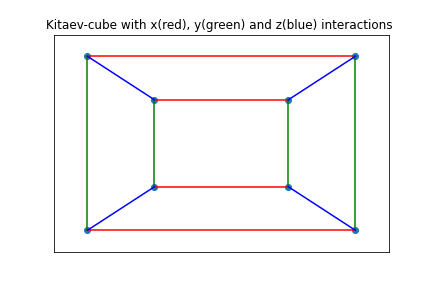
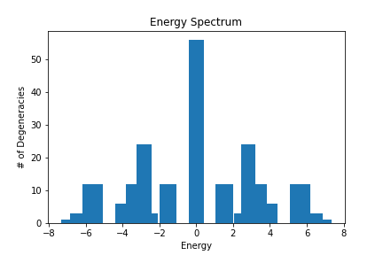
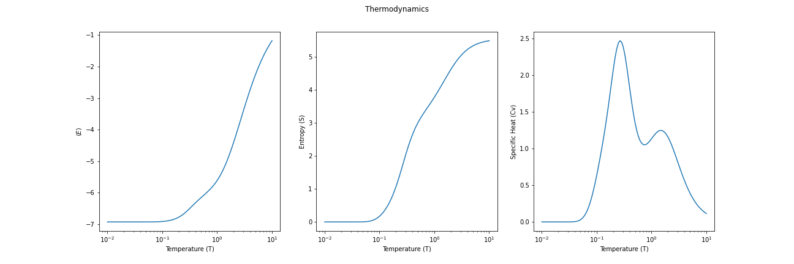

# Exact Diagonalization of Spin Clusters

This module studies finite-size spin-systems or clusters using the exact diagonalization technique.
This is accomplished using a class 'Spin_Cluster' that contain attributes to set up and diagonalize the Hamiltonian to find out the energy eigenvalues of the spin system.
Additionally, it can also compute several thermodynamic properties of the system.

As an example, let us look at the following spin cluster consisting of 8 sites (shown using black dots). Each site is tri-coordinated and have direction-dependent Ising / Kitaev-like couplings. The x,y, and z interactions between the sites are marked using different colours. The interaction strengths for all the couplings are choosen to be J = 1.

The properties of this cluster (Kitaev-cube) including the 12 spin-interactions between the sites are defined in a class 'Kitaev-cube'.
This class also has an instance of the class 'Spin_Cluster' and uses its class attributes to compute the energy eigenvalues.
The following figure shows the energy spectrum of the cluster along with the number of degenerate energy levels. All energy (E) and temperature (k_B T) values are scaled by the interaction strength J.

We can also compute various thermodynamics properties of the cluster.
The following figure shows three thermodynamic quantities:
the energy expectation value <E>, the entropy (S) and the specific heat (Cv) as a function of temperature.
The temperature values are choosen uniformly on a logarithmic scale.
  

The class attributes can also easily be extended to compute expectation values of Operators.
